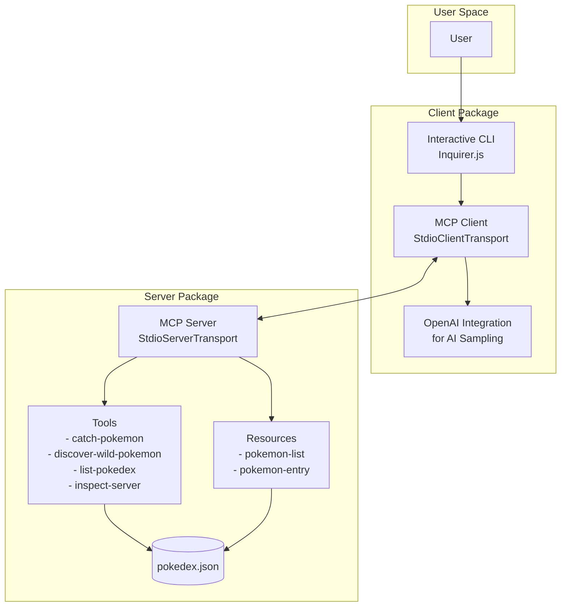
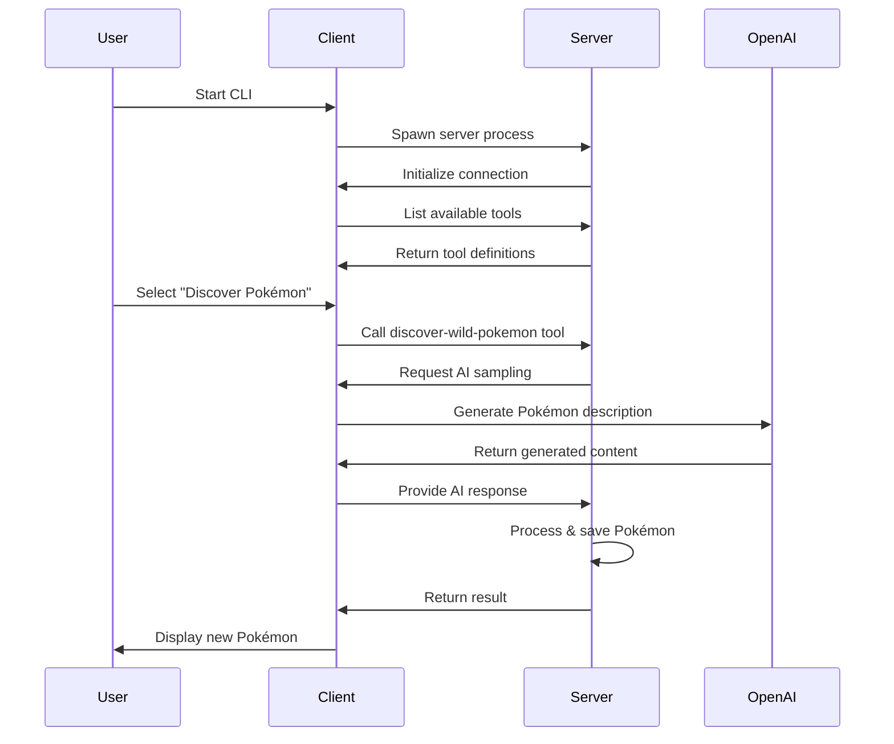
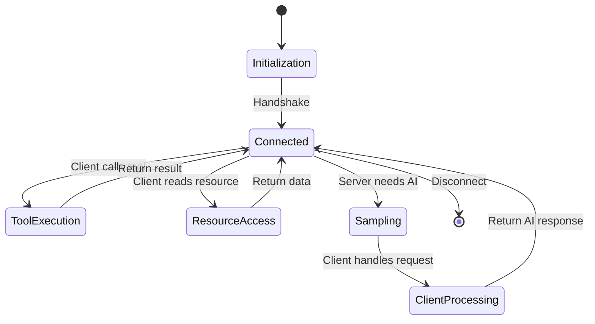

# Pokédex MCP Monorepo

A demonstration project for learning the Model Context Protocol (MCP) by building an interactive Pokédex system with separate server and client implementations.

## What is MCP?

The Model Context Protocol (MCP) is an open protocol that enables seamless integration between AI applications and external data sources or tools. It provides a standardized way for AI models to:
- Access external resources (files, APIs, databases)
- Execute tools and functions
- Sample from AI models
- Handle structured communication between clients and servers

## Project Overview

This monorepo demonstrates MCP concepts through a Pokédex application where:
- The **MCP Server** manages Pokémon data and provides tools for interaction
- The **MCP Client** offers an interactive CLI that connects to the server
- Communication happens through the MCP protocol over stdio transport

## Architecture

### System Architecture



### MCP Communication Flow



## MCP Concepts Demonstrated

### 1. **Tools** (Server → Client actions)
Tools are functions the server exposes for clients to call:

```typescript
// Server defines tools
{
  name: "catch-pokemon",
  description: "Add a new Pokémon to your Pokédex",
  inputSchema: {
    type: "object",
    properties: {
      name: { type: "string" },
      type: { type: "string" },
      description: { type: "string" }
    }
  }
}
```

### 2. **Resources** (Server data exposure)
Resources allow clients to access server data:

```typescript
// Server exposes resources
{
  uri: "pokedex://pokemon-list",
  name: "Pokémon List",
  mimeType: "application/json"
}
```

### 3. **Sampling** (Server → Client AI requests)
The server can request AI assistance from the client:

```typescript
// Server requests AI sampling
const result = await request.sampling.createMessage({
  messages: [{
    role: "user",
    content: "Generate a unique Pokémon..."
  }],
  modelPreferences: { hints: ["gpt-4o-mini"] }
});
```

### 4. **Transport** (Client ↔ Server communication)
Both use stdio transport for process communication:

```typescript
// Client spawns server
const serverProcess = spawn('pnpm', ['--filter', '@pokedex/server', 'start']);

// Both wrap stdio in MCP transport
const transport = new StdioClientTransport({
  command: 'pnpm',
  args: ['--filter', '@pokedex/server', 'start']
});
```

## Project Structure

```
pokedex-mcp-monorepo/
├── packages/
│   ├── client/          # MCP Client implementation
│   │   ├── src/
│   │   │   ├── index.ts      # CLI entry point
│   │   │   └── logger.ts     # Logging utilities
│   │   └── package.json
│   │
│   └── server/          # MCP Server implementation
│       ├── src/
│       │   ├── index.ts      # Server entry point
│       │   ├── tools.ts      # Tool implementations
│       │   ├── logger.ts     # Server logging
│       │   └── data/
│       │       └── pokedex.json  # Data persistence
│       └── package.json
│
├── package.json         # Monorepo root
├── pnpm-workspace.yaml  # PNPM workspace config
└── CLAUDE.md           # AI assistant instructions
```

## Key Features

### Server Features
- **Tool Implementation**: Exposes 4 tools for Pokémon management
- **Resource Serving**: Provides access to Pokédex data
- **AI Integration**: Requests creative content from client's AI
- **Data Persistence**: Saves caught Pokémon to JSON file
- **Structured Logging**: Comprehensive logging with severity levels

### Client Features
- **Interactive CLI**: User-friendly prompts with Inquirer.js
- **Auto-connection**: Spawns and connects to server automatically
- **AI Provider**: Handles server's AI sampling requests via OpenAI
- **Real-time Logging**: Toggle-able log display with color coding
- **Error Handling**: Graceful handling of connection issues

## Getting Started

### Prerequisites
- Node.js 18+
- PNPM package manager
- OpenAI API key

### Installation

1. Clone the repository:
```bash
git clone <repository-url>
cd pokedex-mcp-monorepo
```

2. Install dependencies:
```bash
pnpm install
```

3. Set up environment variables:
```bash
# In packages/client/
cp .env.example .env
# Add your OpenAI API key to .env
```

### Running the Application

```bash
# Build the server and run the client
pnpm dev:client

# Or run each separately:
pnpm build:server  # Build server first
pnpm --filter @pokedex/client dev  # Run client
```

### Development Tools

```bash
# Test server with MCP Inspector
pnpm inspect

# Lint all packages
pnpm lint

# Format code
pnpm format
```

## Learning MCP

This project demonstrates core MCP concepts:

1. **Server Implementation**: See how to create an MCP server that exposes tools and resources
2. **Client Implementation**: Learn to build a client that connects to MCP servers
3. **Bidirectional Communication**: Understand how servers can request AI assistance from clients
4. **Transport Layers**: See stdio transport in action for local process communication
5. **Protocol Messages**: Observe the JSON-RPC based message exchange

## MCP Protocol Flow



## Contributing

This is a learning project. Feel free to:
- Add new Pokémon-related tools
- Implement additional MCP features
- Improve error handling
- Enhance the CLI experience
- Add tests

## Resources

- [MCP Documentation](https://modelcontextprotocol.io)
- [MCP SDK](https://github.com/modelcontextprotocol/sdk)
- [OpenAI API](https://platform.openai.com/docs)

## License

MIT